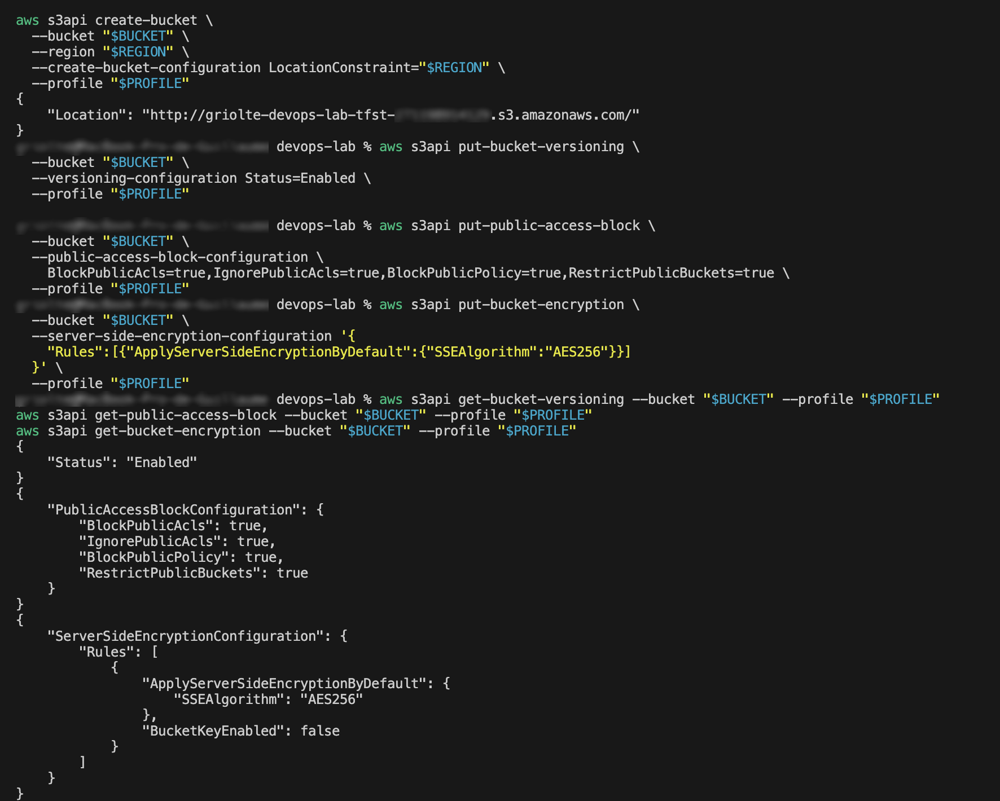
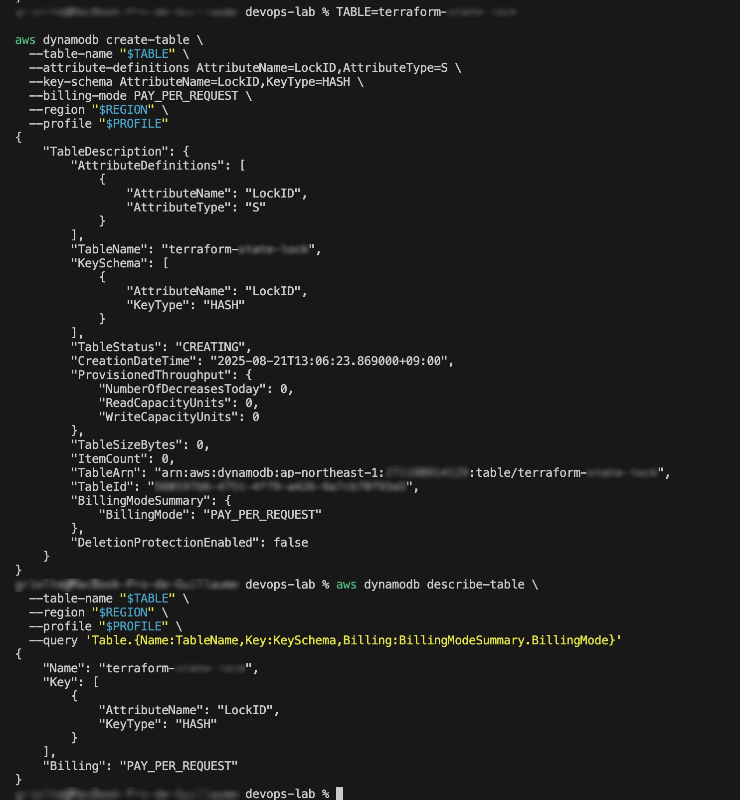
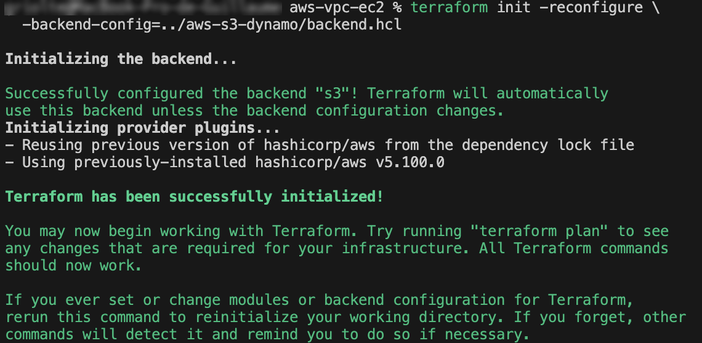
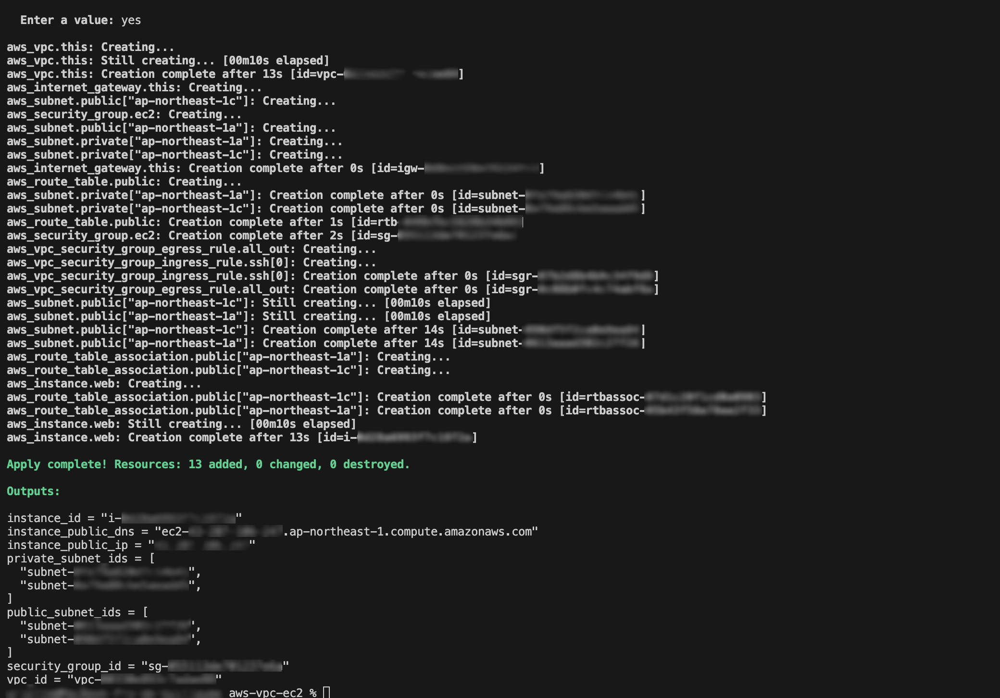
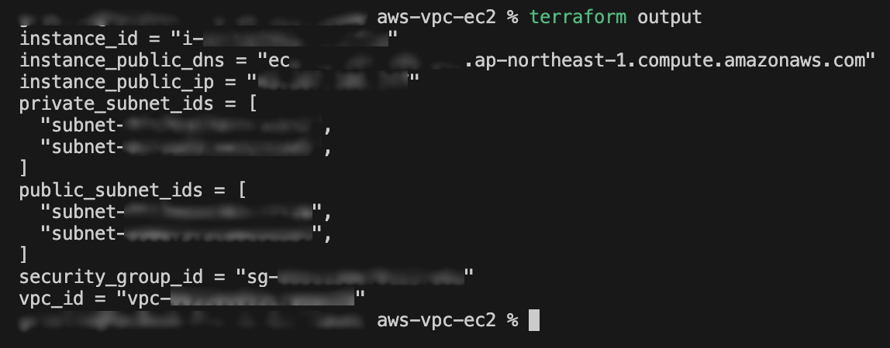
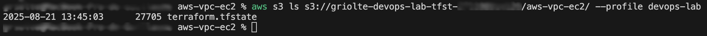
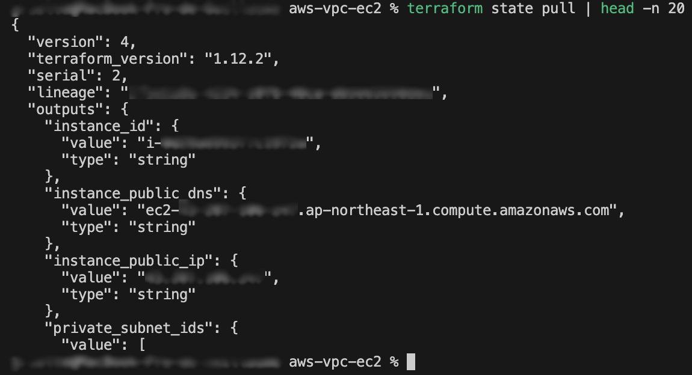
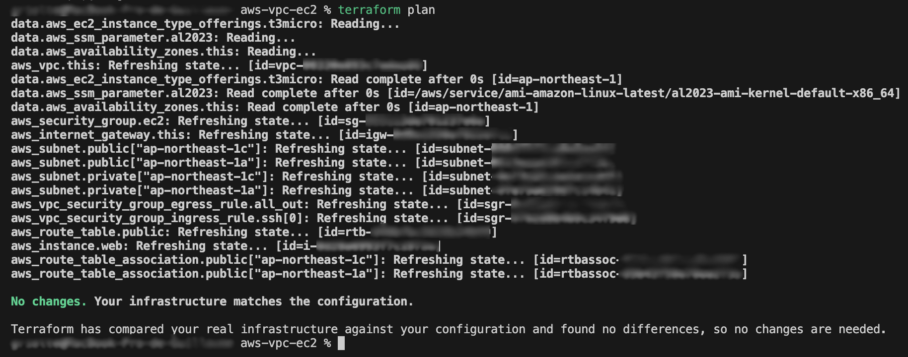

# Terraform Backend – S3 + DynamoDB (v0.2.0)

This module configures a remote backend for Terraform on AWS:

- **S3 bucket** → stores the Terraform state.
- **DynamoDB table** → manages state locking.

---

## Key steps with screenshots

### 1. Create S3 bucket for state

### 2. Create DynamoDB table for state lock

### 3. Initialize Terraform with reconfigure

### 4. Apply configuration (VPC, Subnets, EC2… created for test)

### 5. Show outputs

### 6. Verify tfstate in S3

### 7. Pull Terraform state

### 8. Confirm no changes (plan noop)

---

✅ **Release v0.2.0 successfully validated.**
