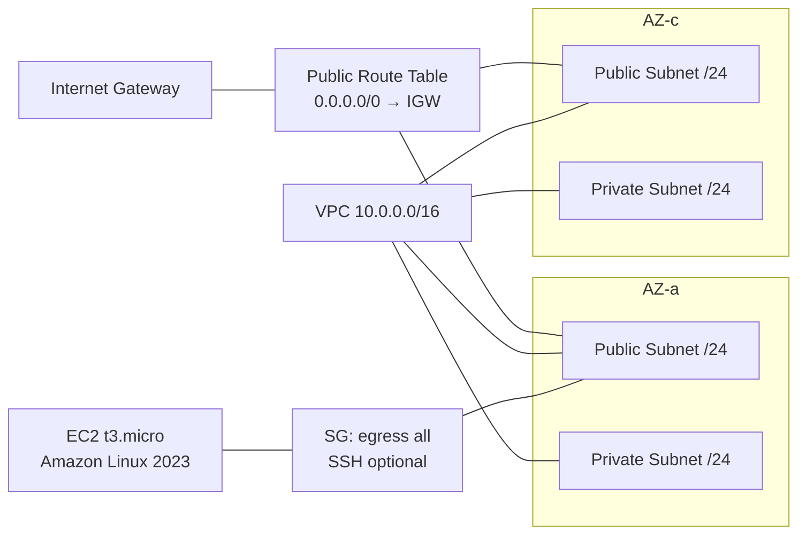

# AWS VPC + EC2 (Free Tier) — Terraform

Provision a minimal AWS network (VPC, public/private subnets, public route table, IGW, SG) and a single **t3.micro** EC2 (Amazon Linux 2023), using a **remote S3 backend** for Terraform state.

> **Terraform**: `1.12.2` · **AWS provider**: `~> 5.x` · **Region**: `ap-northeast-1` (Tokyo)

---

## Repository layout

```
terraform/aws-vpc-ec2/
├── backend.hcl
├── main.tf
├── outputs.tf
├── providers.tf
├── variables.tf
├── versions.tf
└── (optional) terraform.tfvars
```

---

## Prerequisites

- AWS account and a profile (example name: `devops-lab`)
- AWS CLI configured:
  ```bash
  aws sts get-caller-identity --profile devops-lab
  ```
- Terraform `1.12.2` installed

---

## Remote state (S3 backend)

Create a **versioned + encrypted** S3 bucket **once**:

```bash
ACCOUNT_ID=$(aws sts get-caller-identity --query Account --output text --profile devops-lab)
REGION=ap-northeast-1
BUCKET="tf-state-${ACCOUNT_ID}-${REGION}"

aws s3api create-bucket   --bucket "$BUCKET"   --create-bucket-configuration LocationConstraint=$REGION   --region $REGION --profile devops-lab

aws s3api put-bucket-versioning   --bucket "$BUCKET" --versioning-configuration Status=Enabled   --region $REGION --profile devops-lab

aws s3api put-bucket-encryption   --bucket "$BUCKET"   --server-side-encryption-configuration '{"Rules":[{"ApplyServerSideEncryptionByDefault":{"SSEAlgorithm":"AES256"}}]}'   --region $REGION --profile devops-lab
```

`terraform/aws-vpc-ec2/backend.hcl`:
```hcl
bucket  = "tf-state-<ACCOUNT_ID>-ap-northeast-1"
key     = "devops-lab/aws-vpc-ec2/terraform.tfstate"
region  = "ap-northeast-1"
profile = "devops-lab"
```

Initialize:
```bash
cd terraform/aws-vpc-ec2
terraform init -backend-config=backend.hcl -reconfigure
```

---

## Variables (quick reference)

| Name | Type | Default | Description |
|------|------|---------|-------------|
| `vpc_cidr` | string | `"10.0.0.0/16"` | VPC CIDR |
| `instance_type` | string\|null | `null` | If null, auto‑selects `t3.micro` in ap‑northeast‑1 |
| `key_name` | string\|null | `null` | EC2 Key Pair name; leave `null` to skip SSH |
| `ssh_ingress_cidr` | string\|null | `null` | Your `x.x.x.x/32` to allow SSH; `null` = no SSH |
| `allow_ssh_from_anywhere` | bool | `false` | Set `true` to allow `0.0.0.0/0` (not recommended) |

Optional `terraform.tfvars` (edit to your needs):
```hcl
# If you want SSH, set both of these; otherwise keep them null.
key_name                = null         # e.g., "devops-lab-key"
ssh_ingress_cidr        = null         # e.g., "203.0.113.7/32"
allow_ssh_from_anywhere = false

vpc_cidr      = "10.0.0.0/16"
instance_type = null                   # auto-resolves to t3.micro
```

---

## Deploy

```bash
cd terraform/aws-vpc-ec2
terraform fmt -recursive
terraform validate
terraform plan
terraform apply -auto-approve
```

Outputs:
```bash
terraform output
terraform output -raw instance_public_ip
terraform output -raw instance_public_dns
```

**Clean up (avoid costs):**
```bash
terraform destroy -auto-approve
```

---

## Architecture (mermaid)



---

## Screenshots (deliverables)

### Terraform apply


### VPC


### Internet Gateway


### Route Table


### Subnets


### Security Group (Inbound)


### Security Group (Outbound)


### EC2 Instance


---

## Troubleshooting (short)

- **Backend credentials** → export `AWS_PROFILE=devops-lab`; set `profile` in `backend.hcl`; run `terraform init -reconfigure`.
- **HCL errors** → `filter { ... }` blocks must be multi‑line; run `terraform fmt`.
- **Free Tier refusal** → use **`t3.micro`** (some regions deprecate `t2.micro`).
- **SSH “Permission denied (publickey)”** → instance launched without Key Pair. Fix by replacing only the instance:
  ```bash
  terraform apply -replace=aws_instance.web -auto-approve
  ```

---

## Optional CI (does NOT require live AWS creds)

> If you want CI later, create these files in the repo. The workflow runs `terraform fmt/validate` with `-backend=false`, `tflint`, and injects docs into this README via `terraform-docs`.

### 1) `.github/workflows/ci.yml`
```yaml
name: terraform-ci

on:
  push:
    paths:
      - 'terraform/aws-vpc-ec2/**'
      - '.github/workflows/ci.yml'
  pull_request:
    paths:
      - 'terraform/aws-vpc-ec2/**'
      - '.github/workflows/ci.yml'

jobs:
  validate:
    runs-on: ubuntu-latest
    defaults:
      run:
        working-directory: terraform/aws-vpc-ec2

    steps:
      - name: Checkout
        uses: actions/checkout@v4

      - name: Setup Terraform 1.12.2
        uses: hashicorp/setup-terraform@v3
        with:
          terraform_version: 1.12.2

      - name: Terraform fmt (check)
        run: terraform fmt -recursive -check

      # Skip remote backend to avoid needing AWS creds
      - name: Terraform init (no backend)
        run: terraform init -backend=false

      - name: Terraform validate
        run: terraform validate -no-color

      - name: Setup TFLint
        uses: terraform-linters/setup-tflint@v4
        with:
          tflint_version: latest

      - name: TFLint init
        run: tflint --init

      - name: TFLint run
        run: tflint -f compact

      - name: Terraform Docs
        uses: terraform-docs/gh-actions@v1.3.0
        with:
          working-dir: terraform/aws-vpc-ec2
          output-file: README.md
          output-method: inject
          git-push: "true"
          config-file: .terraform-docs.yml
```

### 2) `terraform/aws-vpc-ec2/.tflint.hcl`
```hcl
plugin "aws" {
  enabled = true
  version = ">= 0.33.0"
  source  = "github.com/terraform-linters/tflint-ruleset-aws"
}

config {
  format = "compact"
}

aws_region = "ap-northeast-1"
```

### 3) `terraform/aws-vpc-ec2/.terraform-docs.yml`
```yaml
formatter: markdown table
sections:
  show:
    - header
    - requirements
    - providers
    - inputs
    - outputs
    - resources
content: |-
  {{ .Header }}

  <!-- BEGIN_TF_DOCS -->
  ## Requirements
  {{ include "requirements" }}

  ## Providers
  {{ include "providers" }}

  ## Inputs
  {{ include "inputs" }}

  ## Outputs
  {{ include "outputs" }}

  ## Resources
  {{ include "resources" }}
  <!-- END_TF_DOCS -->
output:
  file: README.md
  mode: inject
sort:
  enabled: true
  by: name
settings:
  anchor: false
```
