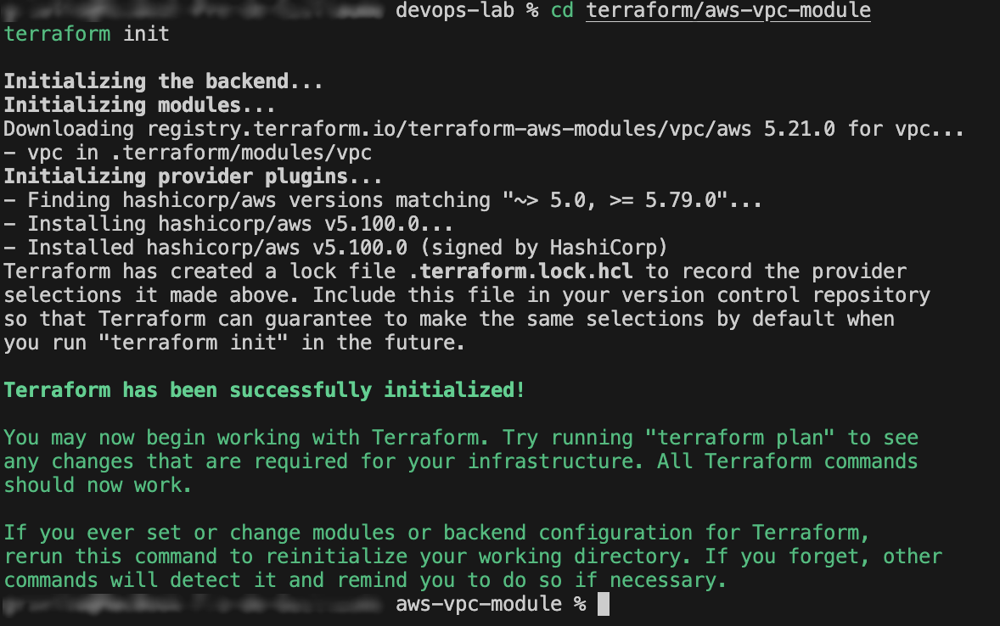

# AWS VPC Module (v0.3.0)

This project deploys an AWS VPC using the official Terraform module:

- 1 VPC with CIDR `10.0.0.0/16`
- 2 public subnets
- 2 private subnets
- Internet Gateway + public route table
- DNS support enabled
- No NAT Gateway (Free Tier friendly)

---

## Key steps with screenshots

### 1. Terraform init

### 2. Terraform plan

### 3. Terraform apply

### 4. Outputs

### 5. AWS Console – VPC

### 6. AWS Console – Subnets

### 7. AWS Console – Route Tables

### 8. Terraform plan noop (after apply)

---

## Architecture (Mermaid)

---

✅ **Release v0.3.0 successfully validated.**
